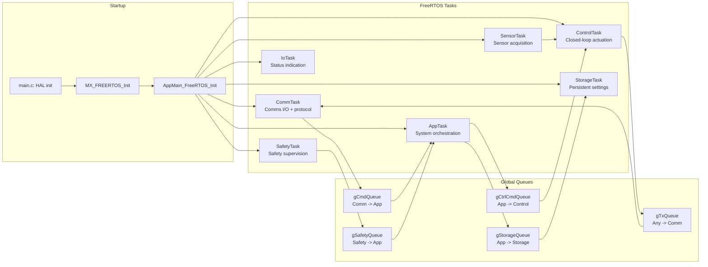
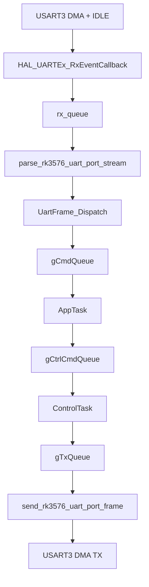
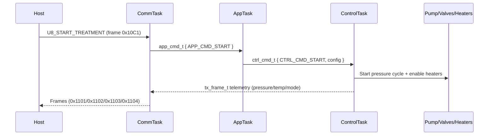
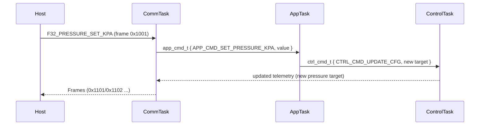

# Program Architecture

This document summarizes the runtime architecture and UART data flow of the
9C-U-TPS Slave firmware (STM32G070 + FreeRTOS).

## System Overview (Tasks + Queues)



## UART Data Path (Business Port)



## Detailed Command Flow (Host -> App -> Control)

```mermaid
flowchart TD
  Host[Host] --> Frame[UART frame: AA55 | id | type | len | payload | crc | 0D0A]
  Frame --> DMA[USART3 DMA + IDLE]
  DMA --> RXISR[HAL_UARTEx_RxEventCallback]
  RXISR --> RXQ[rx_queue (UartRxMessage_t)]
  RXQ --> Parse[parse_rk3576_uart_port_stream]
  Parse --> CRC{CRC OK?}
  CRC -- no --> Drop[Drop frame]
  CRC -- yes --> Dispatch[UartFrame_Dispatch]

  Dispatch -->|APP_CMD_*| CmdQ[gCmdQueue]
  Dispatch -->|Heartbeat| Ack[enqueue U8_HEARTBEAT_ACK -> gTxQueue]
  Dispatch -->|Fuse Blow Cmd| IO[GPIO pulse fuse pin]

  CmdQ --> App[AppTask]
  App --> Update[Update settings/state]
  Update --> CtrlQ[gCtrlCmdQueue]
  CtrlQ --> Ctrl[ControlTask]
  Ctrl --> Actuators[Pump/Valves/Heaters]
  Ctrl --> Telemetry[tx_frame_t -> gTxQueue]
  Telemetry --> CommTX[CommTask -> send_rk3576_uart_port_frame]
  CommTX --> UARTTX[USART3 DMA TX]
```

## Command Examples (Mermaid Sequence)





## Key Source Files

- UART framing and DMA RX/TX: `Application/Uart_Module/uart_driver.c`
- Command dispatch: `Application/Uart_Module/Uart_Communicate.c`
- Communication task: `Application/Tasks/comm_task.c`
- App orchestration: `Application/Tasks/app_task.c`
- Control loop and state machine: `Application/Tasks/control_task.c`
- Sensor sampling: `Application/Tasks/sensor_task.c`
- Safety checks: `Application/Tasks/safety_task.c`
- Settings storage: `Application/Tasks/storage_task.c`
- Protocol specification: `PROTOCOL.md`
