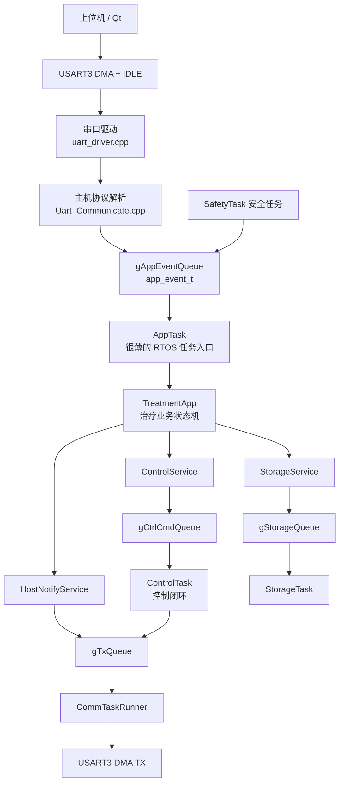

# 9C-U-TPS Slave 固件架构说明

本文档记录当前固件的 C++ 化架构、运行流程，以及后续添加新业务逻辑时推荐的扩展方式。

当前平台：

- MCU：STM32G070
- RTOS：FreeRTOS
- 主机业务串口：USART3 / `rk3576_uart_port`
- 调试日志串口：USART1 / `debug_uart_port`
- 编译方式：C + C++17 混合编译

## 设计目标

当前架构保留 FreeRTOS 的任务模型，但把原来堆在任务函数里的业务逻辑拆到 C++ 类中。

主要目标：

- HAL 回调、FreeRTOS 任务入口继续兼容 STM32Cube 生成的 C 工程。
- 协议解析、业务状态、控制命令、参数保存、上位机通知彼此分离。
- 后续添加上位机命令、PID 调试命令、治疗流程时，不再继续把 `AppTask` 写成一个巨大 `switch`。
- 避免 C++ 运行时负担：默认不使用异常、不使用 RTTI、不使用 `new/delete` 动态创建对象。

## 总体运行流程



## 各任务职责

### `CommTask`

文件：`Application/Tasks/comm_task.cpp`

`CommTask` 仍然是 FreeRTOS 任务入口，但内部实现由 `CommTaskRunner` 类负责。

主要职责：

- 初始化业务串口和调试串口。
- 优先处理业务串口接收数据。
- 把收到的字节流交给协议解析层。
- 每轮只发送有限数量的上位机帧，避免发送遥测时饿死接收路径。

任务入口保持 C 兼容：

```cpp
extern "C" void CommTask(void *argument);
```

### `AppTask`

文件：`Application/Tasks/app_task.cpp`

`AppTask` 现在故意保持很薄，只做几件事：

- 创建一个局部 `TreatmentApp` 对象。
- 从 `gAppEventQueue` 接收 `app_event_t`。
- 把事件交给 `TreatmentApp` 处理。
- 周期调用 `TreatmentApp::service()`。

这样 FreeRTOS 调度逻辑和业务逻辑就分开了。

### `TreatmentApp`

文件：

- `Application/AppMain/TreatmentApp.hpp`
- `Application/AppMain/TreatmentApp.cpp`

`TreatmentApp` 是当前最核心的业务状态机。

它维护治疗相关状态：

- 当前模式
- 是否请求运行
- 是否暂停
- 左右眼是否使能
- 目标温度
- 目标压力
- 治疗循环次数
- 治疗倒计时
- 参数延迟保存时间

它负责处理：

- 开始治疗
- 停止治疗
- 暂停 / 继续
- 模式选择
- 温度设置
- 压力设置
- 治疗时间设置
- 安全故障停机
- 治疗结束后通知上位机

它不直接到处操作队列，而是通过几个 Service 类和其他任务交互。

### `ControlTask`

文件：`Application/Tasks/control_task.c`

`ControlTask` 仍然是底层控制闭环。

主要职责：

- 从 `gCtrlCmdQueue` 接收 `ctrl_cmd_t`。
- 执行压力 PID 和加热 PID。
- 控制气泵、阀、加热 PWM。
- 通过 `gTxQueue` 发送压力、温度、阶段等遥测。
- 根据宏开关输出 PID 调试数据。

`ControlTask` 不应该解析上位机协议，也不应该决定治疗业务流程。

### `SafetyTask`

文件：`Application/Tasks/safety_task.c`

`SafetyTask` 现在把故障作为应用事件上报：

```c
app_event_t event = {0};
event.id = APP_EVT_SAFETY_FAULT;
event.v.safety_fault = fault;
xQueueSend(gAppEventQueue, &event, 0);
```

所有故障后的业务处理都集中在 `TreatmentApp` 中。

## 核心队列

队列类型定义在 `Application/AppMain/system_app.h`，创建位置在 `Application/AppMain/AppMain.c`。

| 队列 | 类型 | 方向 | 作用 |
| --- | --- | --- | --- |
| `gAppEventQueue` | `app_event_t` | 协议/安全 -> App | 统一应用事件入口 |
| `gCtrlCmdQueue` | `ctrl_cmd_t` | App -> Control | 启动、停止、暂停、更新配置 |
| `gTxQueue` | `tx_frame_t` | 其他任务 -> Comm | 上位机发送帧 |
| `gStorageQueue` | `storage_cmd_t` | App -> Storage | 参数加载和保存 |

原来的分散队列已经合并：

- 旧 `gCmdQueue` 已替换为 `gAppEventQueue`
- 旧 `gSafetyQueue` 已替换为 `gAppEventQueue`

## C++ Service 层

文件：

- `Application/Services/AppServices.hpp`
- `Application/Services/AppServices.cpp`

Service 类本质上是对 FreeRTOS 队列的轻量封装，让业务层不用到处写 `xQueueSend()`。

### `ControlService`

`TreatmentApp` 通过它给 `ControlTask` 发命令。

```cpp
control_.post(CTRL_CMD_START, cfg);
control_.post(CTRL_CMD_STOP, cfg);
control_.post(CTRL_CMD_UPDATE_CFG, cfg);
```

### `StorageService`

`TreatmentApp` 通过它请求保存参数。

```cpp
storage_.requestSave();
```

### `HostNotifyService`

`TreatmentApp` 通过它通知上位机。

```cpp
host_.sendTreatmentStopped();
host_.sendU8(frameId, value);
```

## 串口架构

### 串口驱动层

文件：`Application/Uart_Module/uart_driver.cpp`

主要职责：

- 持有 `rk3576_uart_port` 和 `debug_uart_port`。
- 启动 DMA + IDLE 接收。
- 在中断回调里把接收数据复制到串口 RX 队列。
- 组包并发送业务串口帧。
- 通过信号量管理 UART TX DMA 完成状态。

对外 API 仍然通过 `uart_driver.h` 保持 C 兼容。

### 主机协议层

文件：`Application/Uart_Module/Uart_Communicate.cpp`

`HostProtocol` 负责把上位机帧 ID 转换为应用事件。

例子：

```text
F32_PRESSURE_SET_KPA
    -> APP_CMD_SET_PRESSURE_KPA
    -> APP_EVT_HOST_COMMAND
    -> gAppEventQueue
    -> TreatmentApp::handleCommand()
```

心跳比较简单，直接回复上位机：

```text
U8_HEARTBEAT_REQ
    -> U8_HEARTBEAT_ACK
    -> gTxQueue
```

## 如何添加一个新的上位机命令

普通业务命令推荐走这条路径。

### 1. 添加或确认帧 ID

文件：`Application/Uart_Module/Uart_Communicate.h`

如果协议里还没有这个命令，先添加一个新的 `FrameId_t`：

```c
U8_MY_NEW_COMMAND = 0x10D0,
```

### 2. 添加应用命令

文件：`Application/AppMain/system_app.h`

在 `app_cmd_id_t` 中添加：

```c
APP_CMD_MY_NEW_COMMAND,
```

如果数据类型已经能放进 `app_cmd_t::v`，就不需要改结构体。

### 3. 把协议帧转换为应用事件

文件：`Application/Uart_Module/Uart_Communicate.cpp`

在 `HostProtocol::dispatch()` 里添加：

```cpp
case U8_MY_NEW_COMMAND:
    commands_.pushU8(APP_CMD_MY_NEW_COMMAND, readU8(data, length));
    break;
```

这里最终会发送：

```text
APP_EVT_HOST_COMMAND + app_cmd_t
```

到 `gAppEventQueue`。

### 4. 在 `TreatmentApp` 里处理业务

文件：`Application/AppMain/TreatmentApp.cpp`

在 `TreatmentApp::handleCommand()` 里添加：

```cpp
case APP_CMD_MY_NEW_COMMAND:
    // 更新业务状态
    // 必要时调用 ControlService / StorageService / HostNotifyService
    break;
```

## 如何添加一个内部业务事件

如果事件来源不是上位机命令，就走内部事件方式，例如：

- 安全故障
- 本地按键
- 治疗超时
- 传感器触发条件
- 调试触发

### 1. 添加事件 ID

文件：`Application/AppMain/system_app.h`

```c
typedef enum {
    APP_EVT_NONE = 0,
    APP_EVT_HOST_COMMAND,
    APP_EVT_SAFETY_FAULT,
    APP_EVT_MY_INTERNAL_EVENT,
} app_event_id_t;
```

如果需要带数据，就在 `app_event_t` 的联合体里添加字段：

```c
typedef struct {
    app_event_id_t id;
    union {
        app_cmd_t host_cmd;
        uint8_t safety_fault;
        uint16_t my_value;
    } v;
} app_event_t;
```

### 2. 在事件源任务里发布事件

```c
app_event_t event = {0};
event.id = APP_EVT_MY_INTERNAL_EVENT;
event.v.my_value = value;
xQueueSend(gAppEventQueue, &event, 0);
```

### 3. 在 `TreatmentApp` 中处理事件

文件：`Application/AppMain/TreatmentApp.cpp`

```cpp
void TreatmentApp::handleEvent(const app_event_t &event)
{
    switch (event.id) {
        case APP_EVT_MY_INTERNAL_EVENT:
            // 处理内部事件
            break;
        default:
            break;
    }
}
```

## 如何添加 PID 调试命令

推荐路径：

```text
Qt PID 调试帧
    -> HostProtocol
    -> APP_CMD_PID_...
    -> TreatmentApp
    -> ControlService
    -> ControlTask
```

建议的应用命令：

```c
APP_CMD_PID_SELECT_TARGET,
APP_CMD_PID_SET_GAIN,
APP_CMD_PID_DEBUG_ENABLE,
APP_CMD_PID_DEBUG_FORMAT,
```

建议的控制命令：

```c
CTRL_CMD_SET_PID_GAIN,
CTRL_CMD_SET_PID_DEBUG,
```

职责划分：

- `HostProtocol` 只负责解析字节和发布事件。
- `TreatmentApp` 判断当前状态下是否允许执行这个命令。
- `ControlTask` 真正应用 PID 参数，并输出 PID 调试数据。
- Qt 上位机只需要关心帧 ID 和 payload 格式。

## RAM 说明

当前已经做过一轮 RAM 优化：

- `configTOTAL_HEAP_SIZE`：`30000 -> 26000`
- `UART_TX_QUEUE_LENGTH`：`8 -> 4`
- `UART_RX_QUEUE_SIZE`：`10 -> 6`
- `LOG_QUEUE_LEN`：`5 -> 3`

最近一次构建结果：

```text
RAM:   31984 B / 36 KB = 86.76%
FLASH: 107596 B / 128 KB = 82.09%
```

当前最大的 RAM 使用者是 FreeRTOS heap：

```text
ucHeap = 26000 B
```

后续继续调 RAM 时，建议上板看这些值：

```c
xPortGetFreeHeapSize();
xPortGetMinimumEverFreeHeapSize();
uxTaskGetStackHighWaterMark(taskHandle);
```

如果最小剩余 heap 仍然很大，可以继续降低 `configTOTAL_HEAP_SIZE`。
如果进入 `vApplicationMallocFailedHook()`，说明 heap 太小，需要加回来。

## 本项目 C++ 使用约束

为了让 STM32G070 上的固件行为可控，建议遵守：

- 不使用异常。
- 不使用 RTTI。
- 尽量不使用 `new` / `delete`。
- 任务内部优先使用栈上对象或静态对象。
- HAL 回调和 FreeRTOS 任务入口保持 `extern "C"`。
- ISR 中只做最小工作，把复杂逻辑放到任务里处理。
- 协议解析只负责解析协议，不做复杂业务决策。

## 文件地图

| 文件 | 作用 |
| --- | --- |
| `Application/AppMain/system_app.h` | 应用公共类型、事件、队列、任务声明 |
| `Application/AppMain/AppMain.c` | 创建队列和任务 |
| `Application/AppMain/TreatmentApp.hpp/.cpp` | 治疗业务状态机 |
| `Application/Services/AppServices.hpp/.cpp` | 队列封装服务 |
| `Application/Tasks/app_task.cpp` | 很薄的应用任务入口 |
| `Application/Tasks/comm_task.cpp` | 通信任务 runner |
| `Application/Tasks/control_task.c` | 底层控制闭环 |
| `Application/Tasks/safety_task.c` | 故障检测并发布应用事件 |
| `Application/Uart_Module/uart_driver.cpp` | UART DMA/IDLE 驱动和帧发送 |
| `Application/Uart_Module/Uart_Communicate.cpp` | 上位机协议分发 |
| `PROTOCOL.md` | 上位机通信协议说明 |

